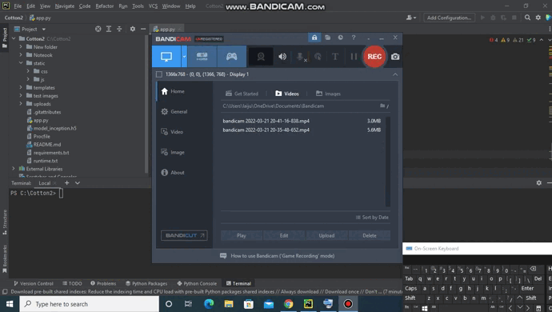

# Cotton-Disease-Prediction

This repository consists of files required for implementation and deployment of Cotton Leaf and Plant Disease Prediction.

## Accuracy:

  

## Loss:

  

## Confusion Matrix:

  

## Classification Report:

  

## A glimpse of the Cotton Disease Prediction Web App:

